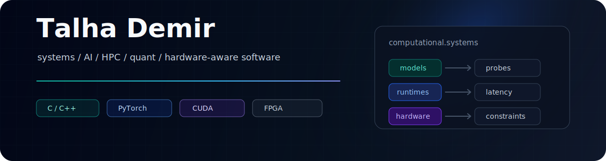

<p align="center">
  
</p>

<p align="center">
  <a href="https://github.com/Talha-Dmr?tab=repositories"></a>
  <a href="https://www.linkedin.com/in/talha-demir-1870421bb/"></a>
  
</p>

I build computational systems where models, performance, and hardware constraints meet.

My work sits around low-level systems, AI infrastructure, high-performance computing, simulation, and quantitative software. I am usually drawn to problems that start as research questions but need to become inspectable, measurable systems.

---

## Operating Area

```text
models / representations  ->  systems / runtime behavior  ->  hardware / latency constraints
       AI tooling          ->       C/C++ infrastructure    ->       GPU / FPGA / HPC
       market state        ->       parsers / simulators    ->       low-latency paths
```

| Direction | What I care about | Typical artifacts |
| --- | --- | --- |
| Systems & performance | memory behavior, concurrency, binary formats, runtime cost | parsers, engines, tooling, C/C++ systems |
| AI systems | retrieval, local models, evaluation, representation analysis | RAG pipelines, model probes, experiment harnesses |
| HPC / hardware-aware software | GPU computing, FPGA-adjacent design, simulation | CUDA-oriented work, VHDL/Verilog experiments, numerical code |
| Quant infrastructure | market data, order books, state modeling, latency | ITCH parsers, order book builders, backtest/simulation tools |

## Selected Work

| Project | Technical angle | Why it matters |
| --- | --- | --- |
| [rag-project](https://github.com/Talha-Dmr/rag-project) | retrieval, reranking, local LLMs, hallucination gates | makes model behavior measurable instead of demo-only |
| [nasdaq-itch-parser](https://github.com/Talha-Dmr/nasdaq-itch-parser) | C++ binary protocol parsing, redundant feeds, arbitration | market data is a good testbed for correctness under throughput pressure |
| [nasdaq-order-book](https://github.com/Talha-Dmr/nasdaq-order-book) | event-driven order book construction in C++ | turns exchange-style event streams into inspectable market state |
| [market-state-representation-learning](https://github.com/Talha-Dmr/market-state-representation-learning) | representation learning for market regimes | explores how financial state can be modeled beyond raw time series |
| [Model-Based-RL](https://github.com/Talha-Dmr/Model-Based-RL) | dynamics modeling, planning, reinforcement learning | connects learned models with control and simulation |
| [cloud-computing](https://github.com/Talha-Dmr/cloud-computing) | services, queues, databases, containerized infrastructure | practical distributed-system substrate for real workloads |

## Current Direction

- Protein and scientific foundation models: representation spaces, probing, and model-assisted discovery.
- Hardware-aware low-latency systems: market data, FPGA/GPU-adjacent computation, and performance paths.
- Systems for AI: local inference, evaluation, retrieval quality, and tools that expose model behavior.

## Stack Signals

<p>
  
  
  
  
  
  
  
  
  
  
  
</p>

## How I Tend To Work

- Build small but complete systems that can be measured.
- Prefer explicit interfaces, reproducible experiments, and inspectable failure modes.
- Treat math, model behavior, latency, and hardware constraints as parts of the same problem.
